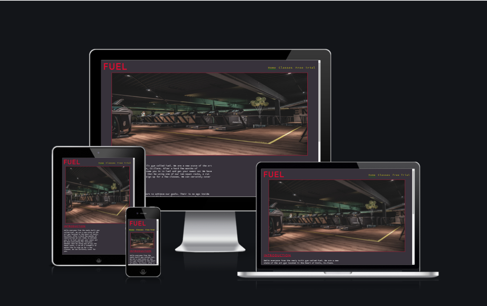
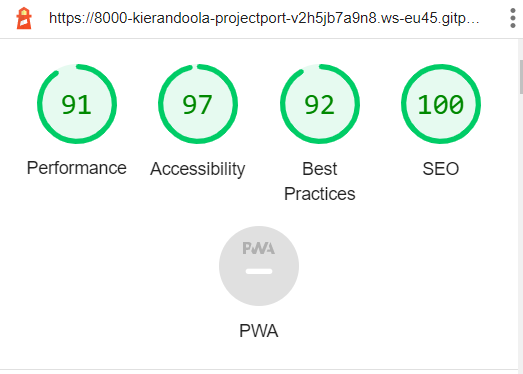
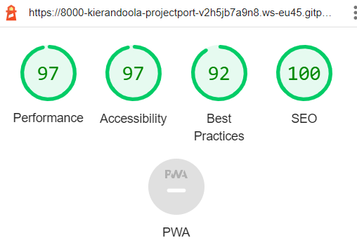
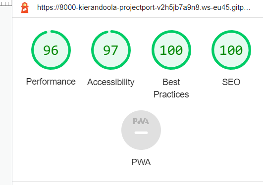
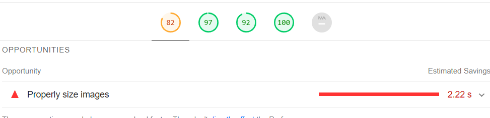

<h1 align="center">Fuel</h1>

[View the live project here.](https://8000-kierandoola-projectport-v2h5jb7a9n8.ws-eu45.gitpod.io/index.html)

This is the main website for Fuel. It is designed to be responsive and accessible on a range of devices, making it easy to navigate for potential clients and visitors of the page.

<h2 align="center"></h2>

## User Experience (UX)

-   ### User stories

    -   #### First Time Visitor Goals

        1. As a First Time Visitor, I want to easily understand the main purpose of the site and learn more about the Gym
        2. As a First Time Visitor, I want to be able to easily navigate throughout the site to find content.
         

    -   #### Returning Visitor Goals

        1. As a Returning Visitor, I want to find information about what classes they have and timings.
        2. As a Returning Visitor, I want to find the best way to get in contact with the organisation with any questions I may have.
    

-   ### Design
    -   #### Colour Scheme
        -   The three main colours used are grey, and white red.
    -   #### Typography
        -   I used google font to select my fonts. They are 'Source Code Pro' and sans-serif. Both are attractive for the website.
    -   #### Imagery
        -   Imagery is important. I used plenty of fitness imagery that look slick and eye-catching.

*   ### Wireframes

    -   All wireframes are [here](readme/docs/wireframes.pdf)

## Features

-   Responsive on all device sizes

### Languages Used

-   [HTML5](https://en.wikipedia.org/wiki/HTML5)
-   [CSS3](https://en.wikipedia.org/wiki/Cascading_Style_Sheets)

### Frameworks, Libraries & Programs Used

1. [Google Fonts:](https://fonts.google.com/)
    - Google fonts were used to import the 'Source Code Pro' font into the style.css file which is used on all pages throughout the project.
1. [Font Awesome:](https://fontawesome.com/)
    - Font Awesome was used on all pages throughout the website to add icons for aesthetic and UX purposes.

1. [Git](https://git-scm.com/)
    - Git was used for version control by utilizing the Gitpod terminal to commit to Git and Push to GitHub.
1. [GitHub:](https://github.com/)
    - GitHub is used to store the projects code after being pushed from Git.
1. [Balsamiq:](https://balsamiq.com/)
    - Balsamiq was used to create the wireframes during the design process.

## Testing

The W3C Markup Validator and W3C CSS Validator Services were used to validate every page of the project to ensure there were no syntax errors in the project.

-   [W3C Markup Validator](https://jigsaw.w3.org/css-validator/#validate_by_input) - [Results](http://jigsaw.w3.org/css-validator/validator?lang=en&profile=css3svg&uri=https%3A%2F%2F8000-kierandoola-projectport-v2h5jb7a9n8.ws-eu45.gitpod.io%2Findex.html&usermedium=all&vextwarning=&warning=1)
-   [W3C CSS Validator](https://jigsaw.w3.org/css-validator/#validate_by_input) - [Results](http://jigsaw.w3.org/css-validator/validator?lang=en&profile=css3svg&uri=https%3A%2F%2F8000-kierandoola-projectport-v2h5jb7a9n8.ws-eu45.gitpod.io%2Findex.html&usermedium=all&vextwarning=&warning=1)

### Testing User Stories from User Experience (UX) Section

-   #### First Time Visitor Goals

    1. As a First Time Visitor, I want to easily understand the main purpose of the site and learn more about the Gym.

        1. Upon entering the site, users see the gym logo and three navigation buttons on the top of the page.
        2. A picture of the gym is shown below this which makes the user want to see more.
        3. The user can scroll down the page to see more details about the gym and what services it provides. The can also see the socials at the bottom of the page and how to contact the gym.

    2. As a First Time Visitor, I want to be able to easily be able to navigate throughout the site to find content.

        1. The site pages are small and easy to read. Straight to the point and the user should find all the information they need easily.
        2. At the bottom of the pages the user will be able to find the social medias of the page to discover more about the website. The also have a contact number to phone Fuel gym and learn more if needs be.
        

### Further Testing

-   The Website was tested on Google Chrome, Microsoft Edge and Safari browsers.
-   The website was viewed on a variety of devices such as Desktop, Laptop and developer tools app which provides mock up phones with responsive.
-   A large amount of testing was done to ensure that all pages were linking correctly.
-   I have tested all three webpages with Lighthouse and have maintained a high standard throughout for Performance, Accessibilty,
    Best Pratice and SEO. Here is Screenshots of all three pages

     <h3 align="center"></h3>
    

      <h3 align="center"></h3>

       <h3 align="center"></h3>

### Fixed Bugs

-   On the Classes Page, there was an issue with the pictures and tables when viewing on smaller screens. I fixed this issue by using clear
    float properties.
-   My hero image also was taking to long and was giving me a low performance of 82
    <h2 align="center"></h2>
To fixed this i deleted the image and downloaded it again at a bigger size which brought up the performance to 91.

### Known Bugs

-   On Mobile Devices, The freetrial page pushes some of the form to the bottom leaving a big open space in the middle.

## Deployment

### GitHub Pages

The project was deployed to GitHub Pages using the following steps...

1. Log in to GitHub and locate the [GitHub Repository](https://github.com/)
2. At the top of the Repository (not top of page), locate the "Settings" Button on the menu.
3. Scroll down the Settings page until you locate the "GitHub Pages" Section.
4. Under "Source", click the dropdown called "None" and select "Master Branch".
5. The page will automatically refresh.
6. Scroll back down through the page to locate the now published site [link](https://github.com) in the "GitHub Pages" section.

## Credits

### Code
-   All my images on the website came from the [Unsplash Website](https://unsplash.com/)
-   The full-screen hero image code came from [Sven Mieke](https://unsplash.com/photos/MsCgmHuirDo)
-   The Hiit Picture came from [Karsten Winegeart](https://unsplash.com/photos/0Wra5YYVQJE)
-   The Spinning Picture came from [David Marioni](https://unsplash.com/photos/F_lns58a_ec)
-   The Zumba Picure came from [Kaspars Eglitis](https://unsplash.com/photos/Vdx-2lsuhm0)
-   The form background image came from [ŞULE MAKAROĞLU](https://unsplash.com/photos/YFmvjO3TP_s)

### Content

-   All content was written by the developer.

### Acknowledgements

-   My Mentor for continuous helpful feedback.

-   Tutor support at Code Institute for their support.

-   The Teachers at Code Institude for helpful videos and walk through project

-   My collegues on the slack app who helped me when i had any issues.